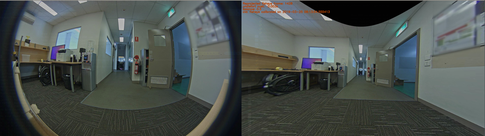

# Rakali (Version 0.0.7)

Rakali is a imaging library and video camera tool-set. It provides a number of
camera primitives to help with calibrating mono and stereo camera rigs, image
processing and object detection. It also includes a number of pre-built tools to
help with that.

Rakali makes use of many other imaging libraries and frameworks and is also intended
to be used as a pedagogical resource for those.


[Pia Ravenari](https://www.deviantart.com/ravenari)

Named after Hydromys chrysogaster, the Australian Otter

# Provided tools

Rakali ships with a number of tools that assists working with mono and stereo
video cameras.


## rakali-find-ipcameras

Scan local LAN for IP cameras by vendor and service.

`$ rakali-find-ipcameras cams`

```
Usage: rakali-find-ipcameras [OPTIONS] COMMAND [ARGS]...

  Discover IP cameras on local LAN

Options:
  --version  Show the version and exit.
  --help     Show this message and exit.

Commands:
  cams     Discover local IP cameras using vendor name
  service  Scanning for video feed services
```

`$ rakali-find-ipcameras cams `

```

Scanning 10.41.212.0/24 for axis cameras or NVRs
['10.41.212.135', '10.41.212.147']
```


## rakali-view

View feed from IP and USB cameras

`$ rakali-view --help`

```
Usage: rakali-view [OPTIONS]

Options:
  --version          Show the version and exit.
  -s, --source TEXT  Video source, can be local USB cam (0|1|2..) or IP cam rtsp URL or file  [default: http://axis-
                     lab/axis-cgi/mjpg/video.cgi?&camera=2]
  --help             Show this message and exit.

```


## rakali-find-chessboards


Find checkerboard images in video feed for calibration purposes

`$ rakali-find-chessboards --help`

```
Usage: rakali-find-chessboards [OPTIONS]

  Test each frame in the stream for the presence of a chess-board pattern. If found, save to the output folder

Options:
  --version                     Show the version and exit.
  -s, --source TEXT             Video source, can be local USB cam (0|1|2..) or IP cam rtsp URL or file  [default:
                                http://axis-lab/axis-cgi/mjpg/video.cgi?&camera=1]
  -o, --output-folder TEXT      Fetch image from URL  [default: ~/rakali/chessboards/]
  --chessboard-rows INTEGER     Chessboard rows  [default: 9]
  --chessboard-columns INTEGER  Chessboard columns  [default: 6]
  --help                        Show this message and exit.
```

## rakali-find-chessboards-stereo


Find checkerboard images in stereo video feed for calibration purposes

`rakali-find-chessboards-stereo --help`

```
Usage: rakali-find-chessboards-stereo [OPTIONS]

  Find chessboard calibration images in both frames of the stereo pair

Options:
  --version                     Show the version and exit.
  -l, --left-eye TEXT           Left eye, can be local USB cam (0|1|2..) or IP cam rtsp URL or file  [default:
                                http://axis-lab/axis-cgi/mjpg/video.cgi?&camera=1]
  -r, --right-eye TEXT          Right eye, can be local USB cam (0|1|2..) or IP cam rtsp URL or file  [default:
                                http://axis-lab/axis-cgi/mjpg/video.cgi?&camera=2]
  -o, --output-folder TEXT      Fetch image from URL  [default: ~/rakali/stereo/chessboards/]
  --chessboard-rows INTEGER     Chessboard rows  [default: 9]
  --chessboard-columns INTEGER  Chessboard columns  [default: 6]
  --help                        Show this message and exit.
```
  

  
## rakali-calibrate-pinhole

Calibrate a video camera with a pinhole lens

`$ rakali-calibrate-pinhole --help `

```
Usage: rakali-calibrate-pinhole [OPTIONS]

  Calibrate pinhole camera using chessboard frames captured earlier.

Options:
  --version                     Show the version and exit.
  -i, --input-folder TEXT       Folder where chessboard images are stored  [default: ~/rakali/chessboards/]
  --image-points-file TEXT      Corner points data  [default: image_points.npz]
  --calibration-file TEXT       Camera calibration data  [default: pinhole_calibration.npz]
  --chessboard-rows INTEGER     Chessboard rows  [default: 9]
  --chessboard-columns INTEGER  Chessboard columns  [default: 6]
  --square-size FLOAT           Chessboard square size in m  [default: 0.023]
  --salt INTEGER                Seed value for random picking of calibration images from a large set  [default: 888]
  --pick-size INTEGER           Size of image set to use for calibration, picked from available set  [default: 50]
  --help                        Show this message and exit.
```


## rakali-calibrate-fisheye

Calibrate a video camera with a fish-eye lens

`$ rakali-calibrate-fisheye --help`

```
Usage: rakali-calibrate-fisheye [OPTIONS]

  Calibrate fish-eye camera using chessboard frames captured earlier.

Options:
  --version                     Show the version and exit.
  -i, --input-folder TEXT       Folder where chessboard images are stored  [default: ~/rakali/chessboards/]
  --image-points-file TEXT      Corner points data  [default: image_points.npz]
  --calibration-file TEXT       Camera calibration data  [default: fisheye_calibration.npz]
  --chessboard-rows INTEGER     Chessboard rows  [default: 9]
  --chessboard-columns INTEGER  Chessboard columns  [default: 6]
  --square-size FLOAT           Chessboard square size in m  [default: 0.023]
  --salt INTEGER                Seed value for random picking of calibration images from a large set  [default: 888]
  --pick-size INTEGER           Size of image set to use for calibration, picked from available set  [default: 50]
  --cid TEXT                    Calibration ID to associate a calibration file with a device  [default: fisheye]
  --help                        Show this message and exit.
  
```

`$ rakali-calibrate-fisheye`

```
Loading previously computed image points from image_points.npz
Calibrating on 50 objects...
INFO:rakali.camera.fisheye:Saving fisheye calibration data to fisheye_calibration.npz
DIM=(1920, 1080)
K=np.array([[558.6421513930135, 0.0, 977.0871045041308], [0.0, 559.5579191046008, 493.7827965652395], [0.0, 0.0, 1.0]])
D=np.array([[-0.018316232894576033], [0.002931049514785237], [-0.0022823146847841804], [0.00014813140230995043]])
Calibration error: 0.8771782112164381
```

## rakali-undistort-pinhole

Correct video feed from calibrated standard pinhole camera 

`$ rakali-undistort-pinhole --help`

```
Usage: rakali-undistort-pinhole [OPTIONS]

  Undistort live feed from pinhole model type camera

Options:
  --version                Show the version and exit.
  -s, --source TEXT        Video source, can be local USB cam (0|1|2..) or IP cam rtsp URL or file  [default:
                           http://axis-lab/axis-cgi/mjpg/video.cgi?&camera=1]
  --calibration-file TEXT  Camera calibration data  [default: pinhole_calibration.npz]
  --help                   Show this message and exit.
```

## rakali-undistort-fisheye

Correct video feed from calibrated fisheye-lens camera 

`$ rakali-undistort-fisheye --help`

```
Usage: rakali-undistort-fisheye [OPTIONS]

  Undistort live video feed from fish-eye lens camera

Options:
  --version                Show the version and exit.
  -s, --source TEXT        Video source, can be local USB cam (0|1|2..) or IP cam rtsp URL or file  [default:
                           http://axis-lab/axis-cgi/mjpg/video.cgi?&camera=1]
  --calibration-file PATH  Camera calibration data  [default: fisheye_calibration.npz]
  -b, --balance FLOAT      Balance value 0.0 ~30% pixel loss, 1.0 no loss  [default: 1.0]
  --help                   Show this message and exit.
  
```

`$ rakali-undistort-fisheye`


`$ rakali-undistort-fisheye -b 0.5`




`$ rakali-undistort-fisheye -b 0`


## rakali-view-stereo

View live feed from stereo camera rig

`$ rakali-view-stereo --help `

```
Usage: rakali-view-stereo [OPTIONS]

Options:
  --version             Show the version and exit.
  -l, --left-eye TEXT   Left eye, can be local USB cam (0|1|2..) or IP cam rtsp URL or file  [default: http://axis-
                        lab/axis-cgi/mjpg/video.cgi?&camera=1]
  -r, --right-eye TEXT  Right eye, can be local USB cam (0|1|2..) or IP cam rtsp URL or file  [default: http://axis-
                        lab/axis-cgi/mjpg/video.cgi?&camera=2]
  --help                Show this message and exit.
  
```


## rakali-split-stereo-feed

Split source stereo recording into left and right camera views
  
`$ rakali-split-stereo-feed --help`

```
Usage: rakali-split-stereo-feed [OPTIONS]

  Split source stereo recording into left and right camera views

Options:
  --version              Show the version and exit.
  -s, --source TEXT      Stereo video source file to split  [default: in.avi]
  -l, --left-name TEXT   Left camera video name  [default: left_eye_out.avi]
  -r, --right-name TEXT  Right camera video name  [default: right_eye_out.avi]
  --fps FLOAT            Frames per second rate for output file  [default: 12.5]
  --help                 Show this message and exit.
```


## rakali

Rakali ships with a small demo app that exercises the library image processing
functionality.

```zsh
$ rakali --help
Usage: rakali [OPTIONS] COMMAND [ARGS]...

  Rakali image tools

  Provide either a input file or a input URL for image source

Options:
  --version               Show the version and exit.
  -i, --input-file PATH   Use file
  -u, --input-url TEXT    Fetch image from URL
  -o, --output-file PATH  Output file  [default: out.jpg]
  --help                  Show this message and exit.

Commands:
  resize          Resize the input image preserving aspect ratio, favoring width
  rotate          Rotate the input image
  rotate-bounded  Rotate the input image, keeping bound in place
  skeletonize     Skeletonize the input image

```

# Library usage

Library documentation generation is a work in progress...

## Load and show image from file

```zsh
from rakali import Image
Image.from_file('rakali.jpg').show()
```

## Load, annotate, and show image

```zsh
#! /usr/bin/env python

from rakali import Image
img: Image = Image.from_file('rakali.jpg')
img.add_text(labels=['Rakali', 'Hydromys chrysogaster'])
img.show()
img.write('rakali-text.jpg')

```


## Canny

```zsh

#! /usr/bin/env python
"""
Cannyfy Live USB video stream
"""

from rakali import VideoPlayer, VideoStream, VideoWriter
from rakali.video.fps import cost
from rakali.video import go
from rakali.annotate import add_frame_labels, colors
import imutils
import logging

logging.basicConfig(level=logging.DEBUG)


@cost
def canny(mat):
    img = imutils.auto_canny(image=mat, sigma=0.3)
    img = add_frame_labels(
        frame=img,
        labels=[f'canny cost: {canny.cost:6.3f}ms'],
        color=colors.get('WHITE'),
    )
    return img


stream = VideoStream(src=0)
player = VideoPlayer()
writer = VideoWriter(size=stream.get_wh_size(), file_name='canny.avi')

with stream, player, writer:
    while go():
        frame = canny(stream.read())
        writer.write(frame)
        player.show(frame)
```


# Install

Rakali is essentially a OpenCV shim and installs the current (unofficial)
opencv-python wheel from PyPi. If you have a custom OpenCV build, make sure that
installing Rakali does not clobber that. 


## pypi

Rakali is in pypi:

```
$ pip install rakali
```

## Manual install

Clone or download this repo and in your virtualenv do:
```
$ pip install .
```

